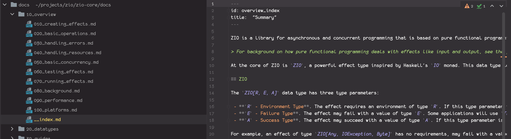

# Gatsby config files

The `gatsby-config.js` id the main gatsby configuration files with options for all the plugins being used. Note that all plugins used in the theme will be inherited by the sites using the theme, so normally the sub-site configs will only contain references to the md src directories rendered in that site instance. 

Within the `gatsby-config.js` we also register the source folder that contains the configuration for the sub projects contained within the site:

```javascript
'gatsby-transformer-yaml',
{
  resolve: `gatsby-source-filesystem`,
  options: {
    name: `projects`,
    path: `${__dirname}/data/`
  }
},
```

Inside the data directory we will have a yaml file with all the projects / versions contained in the site build, for example:

```yaml
- name: "site"
  version: "1.0.0"
  sourceInstance: "docs"
- name: "zio"
  version: "1.0.0"
  sourceInstance: "zio"
- name: "zio"
  version: "1.0.0"
  sourceInstance: "zio-2"
- name: "metrics connectors"
  version: "2.0.0"
  sourceInstance: "metrics-connectors"
```

With a local dev instance up and running, we could navigate to `http://localhost:8000/___graphql` and then use the GraphQL to get all project nodes:

```
query MyQuery {
  allProjectYaml {
    nodes {
      id
      name
      version
      sourceInstance
    }
  }
}
```

With the example data we have in the theme that would give us:

```json
{
  "data": {
    "allProjectYaml": {
      "nodes": [
        {
          "id": "6c5b5a7f-41ec-5e6f-8596-13d5198ee57a",
          "name": "site",
          "version": "1.0.0",
          "sourceInstance": "docs"
        },
        {
          "id": "6d85ae6e-822b-50ac-850a-d6f060d5e73e",
          "name": "zio",
          "version": "1.0.0",
          "sourceInstance": "zio"
        },
        {
          "id": "f73e3691-325f-58c1-b52c-773a1570fd03",
          "name": "zio",
          "version": "1.0.0",
          "sourceInstance": "zio-2"
        },
        {
          "id": "53c18f2e-a09f-5dda-a354-ef35e95d0b66",
          "name": "metrics connectors",
          "version": "2.0.0",
          "sourceInstance": "metrics-connectors"
        }
      ]
    }
  },
  "extensions": {}
}
```

## Gatsby Node 

`gatsby-node.esm.js` has the actual meat of the gatsby site. It is in this file where we use the 
underlying data nodes to create all the pages their supporting components. 

Inside this file the export to create pages is the most important one. In our case we need all mdx nodes and all all project nodes. 

Keep in mind that the root element is rendered for all pages created, so that for each page we generate we must generate everything between the top nav bar and the footer element:

- The secondary navbar specific to the sub site the page belongs to 
- The left hand side bar with the links for the selected sub site category 
- The right hand side bar with the table of contents 
- The actual mdx content

### Top level bar / Left hand side bar 

These will be generated from the sub site folder structure. For the following assume that `docsdir` is the top level folder for the subsite containing the current document. 

Each immediate sub-folder in `docsdir` defines a single category of the sub-site end the category links  make up the secondary navbar. 

The folder/file tree in each category folder are transformed into the left hand side bar. 

> **NOTE**: We want to get away from the sidebar.jsons that we had with docusaurus, so we have to define a way how to map file paths into menu entries. 

### File path mapping



Essentially the structure of the menus resembles the directory structure of the selected subsite.

The name of a file or directory can be one of the following:

- **A name of the form `[0-9]+_$rest`** - In this case the first part of the name is transformed into an integer which is used to order the generated entries within the menu. The rest of the name is used derive the text of the menu. 
- 
- **a normal name** - In this case the entry is used to derive the name of the menu entry. In term of ordering a menu will have the entries with explicit numbers first and then the rest of the entries in alphabetical order. 

- **__index.md** - this is a special case to manipulate the menu entry for the directory containing the file. If present, the frontmatter attribute `sidebar-label` will overwrite the name of the directories menu entry. The mdx content of the index file will be rendered when the direcory menu entry is selected. If no index file exists, the directory menu entry will have no link target. 

So in the example above the highlighted index file actually modifies the menu entry for `10_overview`. As this is a top level directory and the index file has no `sidebar-label` front-matter attribute, the first entry of the secondary navbar will be `Overview`. 

As the index file has actual content, this link will actually have a link target as follows:

- `zio/1.0.0` - sub site context derived from the containing project. 
- `overview` - derived from the directory name / md file
- `http://mySite:8000/zio/1.0.0/overview` would be the resulting link 

The `Overview` sidebar will not have nested menus, but only an entry for ech file within the overview directory. 

### ToC

The table of contents for the current document is available via the gatsby mdx plugin. 

### Content

The Mdx content is provided by the `MDXProvider`. 

# Tailwind config files 

We are using [Tailwind CSS](https://tailwindcss.com/) to make our lifes with CSS a bit easier. For that we configure tailwind as a postcss module, so that the site build will also generate the required CSS.

Further, we neet to add `./src/styles/tailwind.css` within `gatsby-browser.js`. The build process will take all source files into account to understand which Tailwind features are actually used within the site. 

> **NOTE:** To mak this actually work, we must not calculate style names. If we do, we must add 
> the list of potentially generated styles manually to our tailwind configuration. 
> 
> That is actually a good thing as it keeps the embedded CSS minimal. 

# CommmonJS / ES6 

We are using Javascript for the entire site and - more specifically - ES6 modules. Most of the Gatsby config files use ES6 by default, with the exception of `gatsby-node.js` which uses CommonJS as default. We are lifting this by adding a dev dependency in `package.json` and then creating a `gatsby.esm.js` file that uses the ES6 module type. In `gatsby-node.js` we simply import the ES6 version and expose it to CommonJS. 

If other files need to be known as CommonJS as well we would follow the same approach. 
