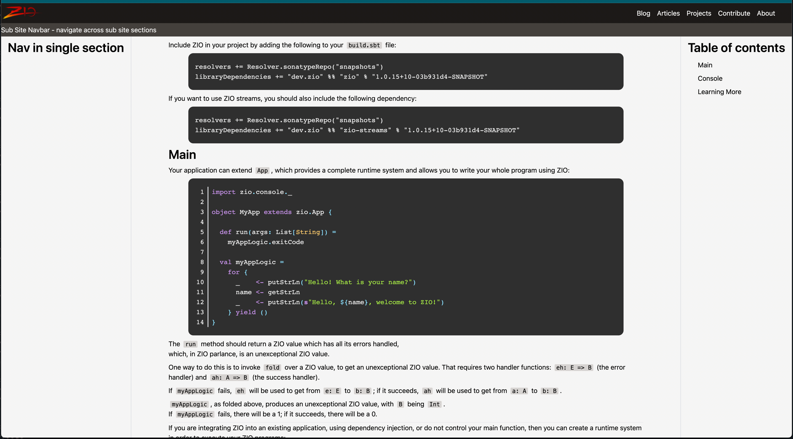

# Using custom components for the MDX rendering 

Gatsby uses MDX under the covers, so we can tap into the MDX rendering process to style the individual components. 

The best way to achieve this is to create a root page that injects a customized `MDXProvider` at top of the React component hierarchy. This is done in `src/components/mdxrender/design.js`:

```javascript
const components = {
  h1: H1,
  h2: H2,
  h3: H3,
  h4: H4,
  h5: H5,
  h6: H6,
  ul: UL,
  ol: OL,
  li: LI,
  p: p => <p className="mb-2" {...p} />,
  pre: p => <pre {...p} />,
  inlineCode: p => <code className="font-mono text-sm bg-primary-300 mx-1 px-1 rounded-sm" {...p} />,
  code: CodeBlock
}

const MDXDesign = (props) => {
  return (
    <MDXProvider components={components}>
      {props.children}
    </MDXProvider>
  )
}
```

The object passed into the `MDXProvider` is basically a map from `MD syntax element` to `React Component`

The most interesting here is the `Codeblock` component that encapsulates the source code rendering with [Prism.js](https://prismjs.com/). `Codeblock` supports linenumbers in the displayed code. These can be turned off with `nonum=true` as parameter on the definition line of the code block, for example:

```
  ```scala nonum=true
  ... code comes here
  
```


